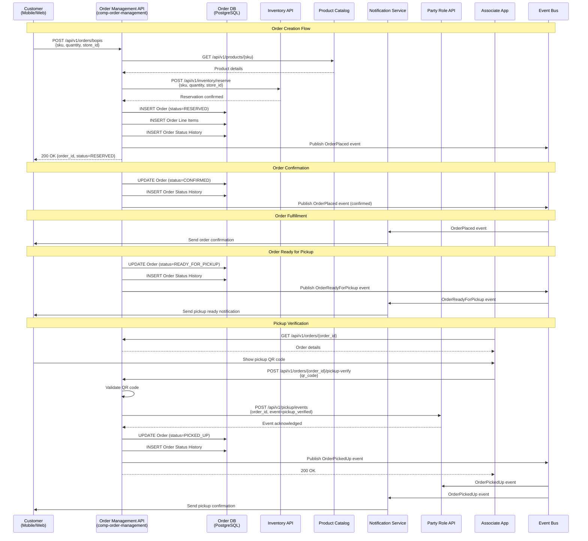
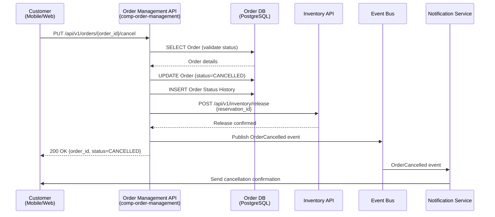

# Domain Architecture: Order

## Context Evidence

- **Workspace**: `ws-init-bopis-order`
- **Domain**: `Order`
- **Domain profile**: `order-management`
- **SA baseline**: `inputs/workstreams/ws-init-bopis-order/architecture-design.yml`
- **Tools used**: `domain-architecture` bootstrap from SA handoff, local repo inspection
- **Generated**: `2026-03-22T20:26:20.8879949Z`

## Domain Boundary

**Bounded context**: BOPIS order lifecycle management from order placement through pickup completion, including order status, cancellation, and pickup readiness.

**Ubiquitous language**:
| Term | Definition |
|---|---|
| BOPIS order | A customer order placed online for store pickup. |
| reservation | The inventory hold created before the order is confirmed. |
| pickup ready | The order has been fulfilled and staged for pickup. |
| pickup completion | The order has been collected by the customer and closed. |

**Anti-corruption layers**:
| External Domain | Strategy | Interface |
|---|---|---|
| Ecommerce | translator | `ifc-product-catalog-api` |
| Inventory | adapter | `ifc-inventory-management-api` |
| Notification | facade | `ifc-notification-api` |
| Party Role Management | adapter | `ifc-pickup-event` |

## Component Landscape

```mermaid
graph TB
    subgraph "Order Domain"
        COMP[Order Management Service<br/>comp-order-management]
        
        subgraph "Internal Data Layer"
            DB[(PostgreSQL<br/>Order Aggregate)]
            EVENT{Event Bus<br/>order.events.status}
        end
        
        COMP -->|Read/Write| DB
        COMP -->|Publish| EVENT
    end
    
    subgraph "External Domains"
        ECOM[Ecommerce Domain<br/>Product Catalog]
        INV[Inventory Domain<br/>Inventory Management]
        NOTIF[Notification Domain]
        PRM[Party Role Management<br/>Pickup Events]
        CUST[Customer Gateway<br/>Mobile App/Web]
        ASSOC[Associate App<br/>Store Associates]
    end
    
    CUST -->|POST /api/v1/orders/bopis| COMP
    CUST -->|GET /api/v1/orders/{order_id}| COMP
    CUST -->|PUT /api/v1/orders/{order_id}/cancel| COMP
    ASSOC -->|GET /api/v1/orders/{order_id}| COMP
    
    COMP -->|GET /api/v1/products/{sku}| ECOM
    COMP -->|POST /api/v1/inventory/reserve| INV
    COMP -->|POST /api/v1/inventory/release| INV
    COMP -->|POST /api/v1/notifications/send| NOTIF
    COMP -->|POST /api/v1/pickup/events| PRM
    
    EVENT -->|OrderPlaced| NOTIF
    EVENT -->|OrderReadyForPickup| NOTIF
    EVENT -->|OrderPickedUp| PRM
    EVENT -->|OrderCancelled| NOTIF
    EVENT -->|OrderCancelled| INV
    
    style COMP fill:#e1f5ff
    style DB fill:#ffe1e1
    style EVENT fill:#fff4e1
    style ECOM fill:#f0f0f0
    style INV fill:#f0f0f0
    style NOTIF fill:#f0f0f0
    style PRM fill:#f0f0f0
```

## Domain Model

### Order (`ord-order`)

**Root entity**: `Order`

**Entities**:
| Entity | Fields | Storage | SID Alignment |
|---|---|---|---|
| Order | `order_id`, `customer_id`, `store_id`, `status`, `created_at`, `updated_at` | PostgreSQL | `CustomerOrder` |
| Order Line Item | `line_item_id`, `order_id`, `sku`, `quantity`, `status` | PostgreSQL | `OrderItem` (local alignment) |
| Order Status History | `event_id`, `order_id`, `from_status`, `to_status`, `changed_at` | PostgreSQL | `CustomerOrder` (history) |

**Value objects**: `OrderId`, `PickupWindow`, `StoreId`

**Domain events**:
| Event ID | Name | Trigger | Payload |
|---|---|---|---|
| `evt-order-placed` | `OrderPlaced` | command | `order_id, customer_id, store_id` |
| `evt-order-ready` | `OrderReadyForPickup` | state transition | `order_id, store_id` |
| `evt-order-picked-up` | `OrderPickedUp` | state transition | `order_id, picked_up_at` |
| `evt-order-cancelled` | `OrderCancelled` | state transition | `order_id, cancel_reason` |

## Workflows

### Order lifecycle (`wf-order-lifecycle`)

**Type**: `state_machine`

**States**: `RECEIVED -> RESERVED -> CONFIRMED -> READY_FOR_PICKUP -> PICKED_UP`, with `CANCELLED` as the terminal exception path.

**Compensating actions**: release inventory reservations when the order is cancelled; keep the order in `READY_FOR_PICKUP` when pickup verification fails and require associate recheck.

**eTOM alignment**: Support Customer Order Management

#### Sequence: BOPIS Order Creation and Fulfillment



#### Sequence: Order Cancellation



## Interface Implementations

### `ifc-order-management-api`

**Component**: `comp-order-management`
**Conformance**: `full`

| Operation | Method | Path | Auth | Rate Limit |
|---|---|---|---|---|
| Create BOPIS order | `POST` | `/api/v1/orders/bopis` | `JWT` | `300 rps` |
| Get order | `GET` | `/api/v1/orders/{order_id}` | `JWT` | `300 rps` |
| List customer orders | `GET` | `/api/v1/orders/customer/{customer_id}` | `JWT` | `300 rps` |
| Cancel order | `PUT` | `/api/v1/orders/{order_id}/cancel` | `JWT` | `300 rps` |

**API Specification Details**:

- `POST /api/v1/orders/bopis`:
  - Request schema: `{customer_id, store_id, items: [{sku, quantity}], pickup_window}`
  - Response schema: `{order_id, status, created_at, estimated_ready_at}`
  - Validation: store exists, inventory available, pickup window valid
  - Idempotency: idempotency-key header for retry handling

- `GET /api/v1/orders/{order_id}`:
  - Response schema: Full order details including line items and status history
  - Caching: 30-second cache for confirmed/ready orders

- `PUT /api/v1/orders/{order_id}/cancel`:
  - Validation: order status must be cancelable (RECEIVED, RESERVED, CONFIRMED)
  - Atomic: database transaction + inventory release in same transaction

### `ifc-order-status-event`

**Component**: `comp-order-management`
**Conformance**: `full`

| Operation | Method | Path | Auth | Rate Limit |
|---|---|---|---|---|
| Publish status event | `EVENT` | `order.events.status` | `service-to-service` | `event-driven` |

**Event Schema**:
```yaml
eventType: string  # OrderPlaced, OrderReadyForPickup, OrderPickedUp, OrderCancelled
eventId: string    # UUID
orderId: string
storeId: string
customerId: string
status: string
timestamp: timestamp
metadata:
  reason?: string      # for cancellation
  picked_up_at?: timestamp  # for pickup completion
  pickup_window?: {start_at, end_at}
```

**Event Delivery Guarantees**:
- At-least-once delivery via message broker
- Duplicate detection on consumer side using eventId
- Dead letter queue for failed events after 3 retries

## Data Consistency & Transaction Management

### Consistency Patterns

- **Strong Consistency**: Order state transitions use ACID transactions on PostgreSQL
- **Eventual Consistency**: Event notifications may arrive up to 5 seconds after state change
- **Saga Compensation**: Inventory reservation release on cancellation

### Transaction Boundaries

1. **Order Creation Transaction**:
   - Insert Order record
   - Insert Order Line Items
   - Insert initial Order Status History
   - All-or-nothing commit on success

2. **State Transition Transaction**:
   - Update Order status
   - Insert Order Status History
   - Publish domain event (after commit)

3. **Cancellation Transaction**:
   - Update Order status to CANCELLED
   - Insert Order Status History
   - Call Inventory API to release reservation
   - All-or-nothing with compensating action on failure

## Error Handling & Resiliency

### Error Codes

| Code | Description | Retry Strategy |
|---|---|---|---|
| `400 Bad Request` | Invalid input, validation failure | No retry |
| `404 Not Found` | Order not found | No retry |
| `409 Conflict` | Order already exists, inventory not available | No retry |
| `422 Unprocessable` | Business rule violation | No retry |
| `500 Internal` | System error | Exponential backoff, max 3 retries |
| `503 Service Unavailable` | Downstream dependency failure | Circuit breaker, fallback |

### Circuit Breaker Configuration

- **Inventory API**: Open after 5 consecutive failures, 30-second cooldown
- **Product Catalog API**: Open after 10 consecutive failures, 60-second cooldown
- **Notification Service**: Best-effort, no circuit breaker

### Retry Policies

- **Idempotent operations**: 3 retries with exponential backoff (100ms, 200ms, 400ms)
- **Non-idempotent operations**: No automatic retries, manual intervention required

## Observability & Monitoring

### Key Metrics

- `order_creation_latency_ms`: Histogram, buckets [10, 50, 100, 200, 500, 1000, 2000, 5000]
- `order_status_update_latency_ms`: Histogram, buckets [5, 10, 25, 50, 100, 250, 500, 1000]
- `cancellation_error_rate`: Gauge, percentage of failed cancellations
- `inventory_reservation_success_rate`: Gauge, percentage of successful reservations
- `orders_by_status`: Gauge, breakdown by status
- `active_reservations_count`: Gauge, current number of inventory reservations

### Logging Strategy

- **Structured JSON logs** with correlation IDs
- **Log levels**: ERROR for failures, WARN for retries, INFO for state transitions, DEBUG for detailed flow
- **Log retention**: 30 days in ELK, 90 days in cold storage
- **Sample traces**: 1% of requests for performance analysis

### Distributed Tracing

- **Trace propagation**: W3C trace context across all services
- **Span names**: `{operation}_{endpoint}` (e.g., `create_order_bopis`)
- **Sampling**: 10% for production, 100% for staging

## TMF Alignment

**Covered APIs**: `TMF622`
**Uncovered APIs**: `TMF620` is consumed from Ecommerce, not owned here
**SID Mappings**: `Order` -> `CustomerOrder`

## Compliance

| Standard | Controls | Notes |
|---|---|---|
| PCI_DSS | encrypt data in transit and at rest; least privilege service access | No payment card storage in this domain |
| GDPR | data minimization; subject access support | Customer order data retained only as required |
| CCPA | access disclosure; deletion workflow coordination | Deletion requests may require downstream coordination |

### Data Retention Policy

- **Active orders**: Retain for 365 days after PICKED_UP or CANCELLED status
- **Status history**: Retain for 365 days with order record
- **Audit logs**: Retain for 7 years for compliance
- **Event bus messages**: 7-day retention in DLQ

### Data Subject Rights Implementation

- **Right of Access**: `/api/v1/customers/{customer_id}/orders` endpoint
- **Right to Deletion**: `/api/v1/customers/{customer_id}/delete` triggers cascade deletion (with archival)
- **Right to Rectification**: PATCH endpoint for correcting customer information
- **Data Portability**: Export endpoint in JSON format

## Security Architecture

### Authentication & Authorization

- **Authentication**: JWT tokens signed with RS256, 1-hour expiration
- **Authorization**: Role-based access control (RBAC)
  - `customer`: Can view and cancel own orders
  - `associate`: Can view and verify pickup orders for assigned store
  - `admin`: Full access to all orders
- **Token Validation**: Verify signature, issuer, audience, and expiration on each request

### Data Protection

- **In Transit**: TLS 1.3 for all external and internal communications
- **At Rest**: AES-256 encryption for PostgreSQL databases
- **Key Management**: AWS KMS or equivalent for encryption keys
- **Secret Management**: HashiCorp Vault or equivalent for API keys and service credentials

### Input Validation & Sanitization

- **Schema Validation**: JSON Schema for all request bodies
- **SQL Injection Prevention**: Parameterized queries only, ORM for data access
- **XSS Prevention**: Content Security Policy headers, input sanitization
- **Rate Limiting**: Per-customer rate limits (100 requests/minute)

## SA Conformance Report

- **NFR budget fit**: `true`
- **Interface conformance**: `conformant`
- **Pattern conformance**: `conformant`
- **Issues**: `none`

## Decisions

| ID | Decision | SA Deviation? | Review Required? |
|---|---|---|---|
| `adr-001` | Order aggregate owns lifecycle transitions and publishes status events | `false` | `false` |
| `adr-002` | Inventory reservation gates order confirmation | `false` | `false` |

## Deployment & Infrastructure

### Container Deployment

- **Container Runtime**: Docker containerized with multi-stage build
- **Orchestration**: Kubernetes deployments with 3 replica minimum
- **Image Registry**: Private registry with vulnerability scanning
- **Rolling Updates**: Zero-downtime deployments with readiness/liveness probes

### Scaling Strategy

- **Horizontal Scaling**: Auto-scaling based on CPU (>70% for 5 minutes) and request queue depth
- **Vertical Scaling**: Container limits: 2 vCPU, 4Gi memory
- **Database Scaling**: Read replicas for read-heavy workloads (order queries)
- **Connection Pooling**: PgBouncer for efficient PostgreSQL connection management

### Disaster Recovery

- **Backup Strategy**: Daily incremental backups, weekly full backups, point-in-time recovery
- **RTO**: 4 hours for complete service restoration
- **RPO**: 5 minutes maximum data loss
- **Multi-AZ Deployment**: Distributed across at least 2 availability zones
- **Failover**: Automated failover to standby instance

### Infrastructure as Code

- **Terraform** for Kubernetes infrastructure
- **Helm Charts** for application deployment
- **GitHub Actions** for CI/CD pipeline
- **Policy as Code**: Open Policy Agent (OPA) for governance enforcement

## Performance Optimization

### Caching Strategy

- **Redis Cache**: Cache frequently accessed orders (CONFIRMED, READY_FOR_PICKUP states)
- **Cache TTL**: 30 seconds for order details, 5 minutes for customer order lists
- **Cache Invalidation**: Write-through cache invalidation on order updates
- **CDN**: Static assets (API documentation, UI assets)

### Database Optimization

- **Indexing Strategy**:
  - Primary key: order_id
  - Composite index: (customer_id, status)
  - Composite index: (store_id, status)
  - Timestamp index: (created_at) for time-based queries
- **Query Optimization**: Materialized views for customer order history
- **Connection Pooling**: 20 connections per replica, maximum 100 connections total

### API Performance

- **Response Time SLA**: P95 < 200ms, P99 < 500ms
- **Throughput SLA**: 300 rps sustained, 1000 rps burst
- **Compression**: Gzip compression for responses > 1KB
- **GraphQL Option**: Consider GraphQL for complex client queries

## Testing Strategy

### Unit Testing

- **Coverage Target**: 80% minimum for business logic, 90% for domain services
- **Testing Framework**: JUnit 5 (Java) or pytest (Python) based on language choice
- **Mocking**: Mockito (Java) or unittest.mock (Python) for external dependencies
- **Test Data**: Test fixtures and factory patterns for consistent test data

### Integration Testing

- **Test Container**: Docker Testcontainers for PostgreSQL and Kafka
- **Contract Testing**: Pact for verifying API contracts with consumers
- **Database Integration**: Flyway migrations tested with test database
- **Message Broker**: Kafka consumer/producer integration tests

### End-to-End Testing

- **Test Scenarios**:
  1. Complete BOPIS order flow from creation to pickup
  2. Order cancellation at each stage
  3. Inventory reservation failure handling
  4. Pickup verification failure and retry
- **Test Environment**: Staging environment with production-like data
- **Test Data**: Synthetic test data generation for performance testing

### Performance Testing

- **Load Testing**: K6 or Gatling for sustained load testing (300 rps for 1 hour)
- **Stress Testing**: Spike tests to 1000 rps for 10 minutes
- **Soak Testing**: 24-hour run at 150 rps to identify memory leaks
- **Performance Regression**: Baseline established for each release

### Security Testing

- **Static Analysis**: SonarQube or Snyk for security vulnerabilities
- **Dynamic Analysis**: OWASP ZAP for runtime security testing
- **Dependency Scanning**: Dependabot or Snyk for vulnerable dependencies
- **Penetration Testing**: Annual third-party security assessment

## Migration & Rollout Strategy

### Phased Rollout

1. **Phase 1 - Canary Deployment** (Week 1):
   - Deploy to 1 replica in production
   - Route 1% of traffic to new version
   - Monitor metrics and error rates
   - Roll back if degradation detected

2. **Phase 2 - Gradual Expansion** (Week 2):
   - Increase to 20% traffic
   - Monitor for 48 hours
   - Address any issues identified

3. **Phase 3 - Full Deployment** (Week 3):
   - Increase to 100% traffic
   - Continue monitoring for 1 week
   - Document lessons learned

### Backward Compatibility

- **API Versioning**: Path-based versioning (/api/v1/) to support older clients
- **Database Migrations**: Non-breaking changes only, reversible migrations
- **Event Schema**: Backward-compatible event schemas with version field
- **Deprecation Policy**: 6-month deprecation notice for breaking changes

## Open Questions

- `Not applicable`
